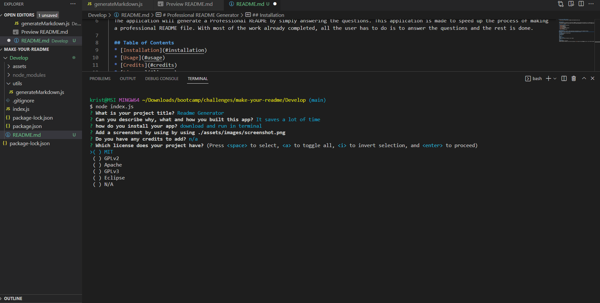

# Professional README Generator
      

  
  ## Description
  The application will generate a Professional README by simply answering questions
  
  ## Table of Contents
  * [Installation](#installation)
  * [Usage](#usage)
  * [Credits](#credits)
  * [License](#license)
  * [Contributing](#lontributing)
  * [Tests](#tests)
  * [Questions](#questions)

  ## Installation
  download and install folder, install node and run node index.js in the integrated terminal
  https://github.com/kristermyr/create-your-readme
  ## Usage
  
  ## Dependencies
  Inquirer
  ## Credits
  n/a
  ## License
  Apache
  ## Contributing
  Create a a Branch and submit a pull request
  ## Tests
  n/a
  ## Questions
  Github Username: kristermyr
  Please send me an E-mail if you have any questions [here](mailto:krister90@gmail.com) or visit https://github.com/kristermyr

